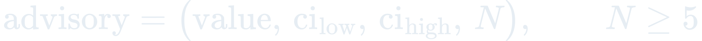

# Djinn

<p>
  <a href="LICENSE"></a>
  
  
  
  
  <a href="https://www.repostatus.org/#wip"></a>
</p>

> **An @enchanted-plugins product — algorithm-driven, agent-managed, self-learning.**

Pins the original session intent, watches for long-horizon drift across `/compact`, and reasserts the goal when the agent diverges.

**6 sub-plugins. 5 engines. 3 agents. 2 slash commands. Out-of-context anchor. One install.**

> Turn 1, the developer says: *"Add dark-mode support with a11y keyboard-trap tests."* D1 Hunt-Szymanski LCS normalizes that into 9 anchor tokens and hashes them into `state/anchor.json`. Turns 2–37, D3 Vitter reservoir samples 32 turn-scores uniformly; D2 Baum-Welch HMM labels each turn ON_TASK / SIDEQUEST / LOST. Turn 38, `/compact` fires — compact-guard injects the anchor as a structural hint **before** the compaction model sees the context. Post-compact, the agent goes sideways into an unrelated toast notifier. Turn 41, drift-aligner's bootstrap 95% CI drops to `(0.48, 0.41–0.55, N=32)`. stderr emits `[Djinn] drift: preservation=0.48 (95% CI 0.41-0.55, N=32) kind=side_quest anchor=feature`. Developer sees it, says "right, back to a11y." One line of stderr; zero token cost in-context; anchor never left state.
>
> Time: structurally guaranteed, zero per-turn LLM calls on the critical path. Developer effort: read one advisory.

## TL;DR

**In plain English:** Long Claude Code sessions quietly drift away from what you originally asked for — especially after a compaction — and by the time you notice, the agent has confidently built the wrong thing.

**Technically:** D1 Hunt-Szymanski LCS captures first-turn intent as a token-anchor persisted to `state/anchor.json`; D2 Baum-Welch HMM labels each subsequent turn ON_TASK / SIDEQUEST / LOST against that anchor; D3 Vitter reservoir keeps a bounded k=32 sample for D4 PageRank ranking and D5 Gauss posterior calibration. Every advisory carries `(preservation_score, ci_low, ci_high, N)` from a 1000-iteration non-parametric bootstrap — no N means no advisory.

---

## Origin

**Djinn** takes its name from **Ars Nouveau** — a fey familiar bound to a Djinn Charm anchor that collects every drop from nearby mobs back to that fixed point, never wandering from it. That is literally the function of this plugin: bind the original session intent as an anchor, collect every agent turn's alignment signal back to that anchor, and reassert the bound goal the moment the agent drifts away from it.

The question this plugin answers: *Am I still working on what you asked?*

## Who this is for

- Developers running multi-hour Claude Code sessions that cross `/compact`. The first-turn goal silently drops out of the middle of the context; Djinn keeps it pinned.
- Teams auditing whether an agent did the work that was requested, not merely work the agent was confident about.
- Anyone whose workflow has surfaced an agent that "fixed" a problem by changing something adjacent to the actual bug.

Not for:

- Single-turn prompts. If the session is short enough that drift cannot happen, Djinn is overhead.
- Token-level drift (read-loops, edit-reverts). That is Emu's territory — Djinn and Emu measure orthogonal signals and must not be merged.

## Contents

- [How It Works](#how-it-works)
- [What Makes Djinn Different](#what-makes-djinn-different)
- [The Full Lifecycle](#the-full-lifecycle)
- [Install](#install)
- [Quickstart](#quickstart)
- [6 Sub-Plugins, 3 Agents, 5 Engines](#6-sub-plugins-3-agents-5-engines)
- [What You Get Per Session](#what-you-get-per-session)
- [Roadmap](#roadmap)
- [The Science Behind Djinn](#the-science-behind-djinn)
- [vs Everything Else](#vs-everything-else)
- [Agent Conduct (12 Modules)](#agent-conduct-12-modules)
- [Architecture](#architecture)
- [Acknowledgments](#acknowledgments)
- [Versioning & release cadence](#versioning--release-cadence)
- [Contributing](#contributing)
- [Citation](#citation)
- [License](#license)

## How It Works

Djinn runs a five-engine pipeline that treats intent preservation as *out-of-context anchoring → deterministic per-turn scoring → structurally-guaranteed compaction survival → cross-session Bayesian calibration*. The premise: every production approach to LLM intent preservation has a documented failure mode, and each one shares a common shape — putting the anchor in-context or asking the agent to self-report.

<p align="center">
  <a href="docs/assets/pipeline.mmd" title="View pipeline source (Mermaid)">
    
  </a>
</p>

<sub align="center">

Source: [docs/assets/pipeline.mmd](docs/assets/pipeline.mmd) · Regeneration command in [docs/assets/README.md](docs/assets/README.md).

</sub>

1. **Anchor lives out-of-context.** `intent-anchor` writes the first-turn goal to `state/anchor.json` on SessionStart. It is never re-echoed into the prompt mid-session; mid-context repetition lives in the recall valley (Liu et al. "Lost in the Middle", NAACL 2024) and buys zero recall.
2. **Deterministic per-turn measurement.** `drift-aligner` runs D1 Hunt-Szymanski LCS + D2 Baum-Welch HMM + D3 Vitter reservoir on every `PostToolUse`. No LLM judgment is in the measurement path. A drifted agent confidently self-reports as on-task (Shinn et al. Reflexion 2023); deterministic compute is the only honest signal.
3. **Structural compaction survival.** `compact-guard` injects the anchor as a hint **before** the compaction model runs. Survival is not up to the compactor's recency bias — it is structurally guaranteed by the hook lifecycle.
4. **Cross-session calibration.** `drift-learning` folds each completed session's summary statistics into a per-(intent-type × developer) drift-signature posterior via D5 Gauss Accumulation. A "research" session earns a wider tolerated drift band than a "bugfix" session.
5. **Honest-numbers advisories.** Every advisory carries `(preservation_score, ci_low, ci_high, N)` from a non-parametric bootstrap over the D3 reservoir. No N → no advisory. The Haiku validator enforces the tuple shape.

## What Makes Djinn Different

### Anchor is structural state, not in-context text

LangChain `ConversationBufferMemory` drops old turns including the first-turn goal. Manual CoT goal-repetition places reminders into the recall valley. Djinn's anchor is a file on disk, hashed at SessionStart, reinjected exactly once at PreCompact. Compaction cannot silently drop it; repetition cannot fall into mid-context noise.

### Measurement is deterministic

ReAct and Reflexion ask the suspect. GPT-as-judge / Claude-as-judge single-model pipelines agree with the agent because of shared priors, not truth. Djinn's D1 LCS, D2 HMM, D3 reservoir, D4 PageRank, and D5 EMA are all deterministic stdlib-only compute. LLM judgment is isolated to the `orchestrator` Opus agent's final advisory verdict — never in the scoring path.

### DAG edges are provable, not inferred

LlamaIndex / LangChain vector-RAG over history retrieves *similar* turns, which is not *intent-preserving* turns. Two drifted agents can mutually retrieve each other's drift as "relevant context". D4 PageRank ranks by DEMONSTRATED influence on output — DAG edges are file-touch overlaps, not cosine similarity.

### Honest numbers, or no numbers

Every drift advisory carries `(preservation_score, ci_low, ci_high, N)` from a 1000-iteration bootstrap. If `N < 5`, `orchestrator` returns `insufficient_data` and refuses to fabricate a band. No score inflation at session boundaries, no "it should work" reporting.

<p align="center">= 5"></p>

<p align="center"></p>

### Orthogonal to Emu, not overlapping

Emu measures *token economy* drift (A1 Markov on tool patterns — read-loops, edit-reverts). Djinn measures *semantic intent* drift (D1 LCS on goal-tokens). A session can have a green Markov state and ample token runway while having silently redirected to a task the user never asked for. The two signals are orthogonal; subscribing to `emu.checkpoint.saved` enriches Djinn's signal but does not replace it.

## The Full Lifecycle

A session flows top-to-bottom through four hook phases plus two developer-invoked skills.

<p align="center">
  <a href="docs/assets/lifecycle.mmd" title="View lifecycle source (Mermaid)">
    
  </a>
</p>

<sub align="center">

Source: [docs/assets/lifecycle.mmd](docs/assets/lifecycle.mmd) · Regeneration command in [docs/assets/README.md](docs/assets/README.md).

</sub>

| Phase | Event | Sub-plugin | Engines | Output |
|-------|-------|------------|---------|--------|
| Capture | SessionStart | `intent-anchor` | D1 + D3 | `state/anchor.json`; `djinn.intent.captured` |
| Refresh | UserPromptSubmit | `intent-anchor` | D1 | appended `refresh_delta`; `djinn.intent.refreshed` |
| Align | PostToolUse | `drift-aligner` | D1 + D2 + D3 | `state/reservoir.json`, `state/states.jsonl`; `djinn.drift.detected` |
| Guard | PreCompact | `compact-guard` | D1 | stdout hint injection; `djinn.compact.intent-hint.injected` |
| Learn | PreCompact | `drift-learning` | D5 | `state/posteriors.json`, `state/learnings.jsonl` |
| Audit | `/rank` | `utterance-rank` | D4 | PageRank of utterance DAG |
| Re-pin | `/reorient` | `intent-reorient` | — | fresh anchor, archived old anchor |

Every phase is advisory-only and fail-open. No phase blocks tool completion or model inference.

## Install

Djinn ships as a 7-plugin marketplace (6 sub-plugins + 1 meta). The `full` meta-plugin lists all six as dependencies, so a single install pulls in the whole pipeline.

**In Claude Code** (recommended):

```
/plugin marketplace add enchanted-plugins/djinn
/plugin install full@djinn
```

Claude Code resolves the dependency list and installs all 6 sub-plugins. Verify with `/plugin list`.

**Cherry-pick** individual sub-plugins if you only want part of the pipeline — e.g. `/plugin install intent-anchor@djinn` captures the anchor without running per-turn alignment. Missing-engine degradation is graceful: `drift-aligner` is a no-op without an anchor, `compact-guard` is a no-op without an anchor, `drift-learning` is a no-op without a reservoir.

## Quickstart

```
/plugin install full@djinn
# ...start a normal session with a clear first-turn goal...
# ...work for a while, let /compact fire...
/rank
```

Expected: `/rank` returns the top-5 utterances by PageRank score with their D1 alignment. On drift, `drift-aligner` has already emitted a stderr advisory with the honest-numbers tuple. See [docs/getting-started.md](docs/getting-started.md) for the guided first run.

## 6 Sub-Plugins, 3 Agents, 5 Engines

| Sub-plugin | Owns | Trigger | Agent |
|------------|------|---------|-------|
| [intent-anchor](plugins/intent-anchor/) | D1 + D3 anchor capture | hook-driven (SessionStart + UserPromptSubmit) | — |
| [drift-aligner](plugins/drift-aligner/) | D1 + D2 + D3 per-turn alignment | hook-driven (PostToolUse) | aligner (Haiku), topic-tagger (Sonnet) |
| [compact-guard](plugins/compact-guard/) | D1 intent-hint injection | hook-driven (PreCompact) | — |
| [utterance-rank](plugins/utterance-rank/) | D4 PageRank | skill-invoked (`/rank`) | — |
| [drift-learning](plugins/drift-learning/) | D5 Gauss Accumulation | hook-driven (PreCompact) | — |
| [intent-reorient](plugins/intent-reorient/) | manual re-pin + Opus orchestrator | skill-invoked (`/reorient`) | orchestrator (Opus) |

Plus `full/` — the meta-plugin dependency manifest that pulls all six in via one install.

Slash commands:

| Command | Function | Agent tier |
|---------|----------|------------|
| `/rank` | On-demand PageRank over the session utterance DAG | — (deterministic) |
| `/reorient <new_intent>` | Manual override of the session anchor | Opus (orchestrator) |

## What You Get Per Session

Every PostToolUse feeds three state files (reservoir, states log, posterior book); PreCompact folds a session summary into the cross-session posterior. All writes go through the atomic `shared/scripts/state_io.atomic_write_json` helper.

<p align="center">
  <a href="docs/assets/state-flow.mmd" title="View state-flow source (Mermaid)">
    
  </a>
</p>

<sub align="center">

Source: [docs/assets/state-flow.mmd](docs/assets/state-flow.mmd) · Regeneration command in [docs/assets/README.md](docs/assets/README.md).

</sub>

```
plugins/intent-anchor/state/
└── anchor.json                session-intent anchor + refresh_deltas (captured once per session)

plugins/drift-aligner/state/
├── reservoir.json             Vitter Algorithm R bounded-memory sample (k=32) of turn-score records
└── states.jsonl               append-only HMM observation log (tool, topic, score per turn)

plugins/drift-learning/state/
├── posteriors.json            per-(intent-type × developer) drift-signature posterior (D5 EMA)
└── learnings.jsonl            per-session append-only summary (backtesting source)

plugins/utterance-rank/state/
└── last-rank.json             most recent /rank output

plugins/intent-reorient/state/
└── archive/                   archived anchors from prior /reorient invocations
```

Events published on the `djinn.*` namespace (Phase-1 file-tail fallback via shared `publish.py`):

- `djinn.intent.captured` — `{session_id, anchor_text, anchor_hash, intent_type, captured_at}`
- `djinn.drift.detected` — `{session_id, preservation_score, ci_low, ci_high, N, turn, drift_kind}`
- `djinn.compact.intent-hint.injected` — `{session_id, hint_text, anchor_hash, pre_compact_turn_count}`
- `djinn.intent.refreshed` — `{session_id, new_anchor_delta, turn}`

Optional subscriptions (Phase-2 enrichment): `emu.checkpoint.saved`, `crow.change.classified`.

## Roadmap

Tracked in [docs/ROADMAP.md](docs/ROADMAP.md) and the shared [ecosystem map](docs/ecosystem.md). For upcoming work specific to Djinn, see issues tagged [roadmap](https://github.com/enchanted-plugins/djinn/labels/roadmap).

## The Science Behind Djinn

Full derivations live in [docs/science/README.md](docs/science/README.md). Each engine cites its founding paper in its docstring.

| ID | Engine | Reference |
|----|--------|-----------|
| D1 | Hunt-Szymanski LCS Alignment | Hunt J.W. and Szymanski T.G. (1977), "A fast algorithm for computing longest common subsequences", CACM 20(5):350-353 |
| D2 | Baum-Welch HMM Task-Boundary Inference | Baum L.E. and Welch L. (1970), "An inequality and associated maximization technique in statistical estimation for probabilistic functions of Markov processes" |
| D3 | Vitter Reservoir Sampling — Algorithm R | Vitter J.S. (1985), "Random sampling with a reservoir", TOMS 11(1):37-57 |
| D4 | PageRank Utterance-DAG Ranking | Brin S. and Page L. (1998), "The anatomy of a large-scale hypertextual Web search engine", Stanford InfoLab |
| D5 | Gauss Accumulation — Intent-Type Drift Signature | Gauss C.F. (1809), *Theoria Motus Corporum Coelestium* |

## vs Everything Else

| Approach | Failure mode in production | Djinn counter |
|---|---|---|
| LangChain `ConversationBufferMemory` / LlamaIndex memory | Drops old turns; first-turn goal is mid-context by turn 40 and silently falls into the recall valley | Anchor is out-of-context state; survives arbitrary compaction |
| LangChain summary memory | Summarization is lossy; detail-specific intent ("with a11y attrs") rarely survives many rounds | D1 LCS operates on the ORIGINAL anchor, never a summary |
| LlamaIndex retrievers / vector-RAG over history | Retrieves *similar* turns, not *relevant-to-original-intent* turns — agents can retrieve each other's drift | D4 PageRank on file-touch DAG — edges are provable, not inferred |
| Manual CoT goal-repetition | Mid-context reminders live in the recall valley; cost tokens, buy zero reliable preservation | Anchor reinjected ONLY at PreCompact, structurally anchored to the forgetting moment |
| OpenAI Custom GPTs / system-prompt pinning | Rigid — doesn't absorb constraint deltas the developer adds mid-session | UserPromptSubmit appends deltas with a `drift_kind` label; never replaces |
| Claude Code `/compact` / ChatGPT auto-summary | Compactor recency-weights; first-turn goal silently drops; 10–20% session-abandonment correlates | compact-guard injects anchor BEFORE compactor runs — survival is lifecycle-guaranteed |
| ReAct / Reflexion / solo self-critique | Drifted agent confidently self-reports as on-task | Djinn never asks the agent; deterministic D1+D2+D4+D5 only |
| BabyAGI / AutoGPT / MetaGPT planning | Plan drifts from goal independently; compounds | Djinn doesn't plan. It anchors and measures. |
| GPT-4-as-judge / Claude-as-judge single-model | Single-family judge correlates with single-family agent via shared priors, not truth | LLM judgment isolated to the Opus orchestrator's final verdict — never in the scoring path |
| Emu (sibling) misused as intent-preservation | A1 Markov catches token-level drift; session can be green on tool patterns and silently redirected | Djinn measures semantic intent — orthogonal signal, coexists with Emu |

## Agent Conduct (12 Modules)

Twelve behavioral modules live in [`shared/conduct/`](shared/conduct/). They apply to every skill and every hook. Inherited verbatim from the [schematic](https://github.com/enchanted-plugins/schematic) canonical template and not edited by Djinn.

| Module | Covers |
|--------|--------|
| [discipline](shared/conduct/discipline.md) | Think-first, simplicity, surgical edits, goal-driven loops |
| [context](shared/conduct/context.md) | Attention-budget hygiene, U-curve placement, checkpoint protocol |
| [verification](shared/conduct/verification.md) | Independent checks, baseline snapshots, dry-run for destructive ops |
| [delegation](shared/conduct/delegation.md) | Subagent contracts, tool whitelisting, parallel vs. serial rules |
| [failure-modes](shared/conduct/failure-modes.md) | 14-code taxonomy for `learnings.jsonl` so D5 can aggregate |
| [tool-use](shared/conduct/tool-use.md) | Tool-choice hygiene, error payload contract, parallel-dispatch rules |
| [formatting](shared/conduct/formatting.md) | Per-target format, prefill + stop sequences |
| [skill-authoring](shared/conduct/skill-authoring.md) | SKILL.md frontmatter discipline, discovery test |
| [hooks](shared/conduct/hooks.md) | Advisory-only hooks, injection over denial, fail-open |
| [precedent](shared/conduct/precedent.md) | Log self-observed failures to `state/precedent-log.md` |
| [tier-sizing](shared/conduct/tier-sizing.md) | Agent-tier budget allocation per task class |
| [web-fetch](shared/conduct/web-fetch.md) | External-URL-handling hygiene |

## Architecture

Interactive architecture explorer with sub-plugin diagrams, agent cards, and hook binding maps:

**[docs/architecture/](docs/architecture/)** — auto-generated from the codebase. Run `python docs/architecture/generate.py` to regenerate.

## Acknowledgments

- **Hunt J.W. and Szymanski T.G.** — the 1977 LCS algorithm underpinning D1.
- **Baum L.E. and Welch L.** — the 1970 HMM re-estimation result underpinning D2.
- **Vitter J.S.** — Algorithm R, the 1985 reservoir-sampling primitive underpinning D3.
- **Brin S. and Page L.** — the 1998 PageRank paper underpinning D4.
- **Gauss C.F.** — the 1809 least-squares foundation underpinning D5.
- **Liu et al.** — "Lost in the Middle" (NAACL 2024) — documented the recall valley that justifies the out-of-context anchor design.
- **Shinn et al.** — Reflexion (2023) — documented why solo self-critique on drift is near-chance without external evaluators.
- **BaileyHoll** — Ars Nouveau (2020) — the Minecraft mod whose Djinn familiar gave this plugin its name and its metaphor.
- **@enchanted-plugins** siblings — Wixie, Emu, Crow, Hydra, Lich, Sylph, Pech — for the canonical template, the event-bus pattern, and the ecosystem contract.

## Versioning & release cadence

Djinn follows [Semantic Versioning](https://semver.org/spec/v2.0.0.html). Breaking changes to engine signatures, event payloads, or the honest-numbers tuple shape bump the major version. Additive engines or sub-plugins bump the minor. Bug fixes bump the patch. See [CHANGELOG.md](CHANGELOG.md) for the running history.

## Contributing

Pull requests welcome — read [CONTRIBUTING.md](CONTRIBUTING.md) first. Key rules:

- Do not edit `shared/conduct/*.md` in a Djinn PR; raise the change in the [schematic](https://github.com/enchanted-plugins/schematic) repo.
- Every new engine needs an Author-Year docstring citation and a `docs/science/README.md` section.
- Every hook script opens with the subagent-loop guard and exits 0 fail-open.
- Honest-numbers contract on every advisory: no N, no advisory.

## Citation

See [CITATION.cff](CITATION.cff) for machine-readable citation metadata.

```
@software{djinn_2026,
  title   = {Djinn: Anchor-bound intent preservation for long-horizon Claude Code sessions},
  author  = {{enchanted-plugins}},
  year    = {2026},
  url     = {https://github.com/enchanted-plugins/djinn},
  license = {MIT}
}
```

## License

MIT — see [LICENSE](LICENSE).
