# Formal Derivations — Djinn

Paper-grounded derivations for each of the five named engines. Implementation in `shared/scripts/engines/c{1..5}_*.py`.

---

## D1 — Hunt-Szymanski LCS Alignment

**Reference:** Hunt J.W. and Szymanski T.G. (1977), "A fast algorithm for computing longest common subsequences", *Communications of the ACM* 20(5):350-353.
**Signature:** `preservation_ratio(anchor_tokens: list[str], current_tokens: list[str]) -> float ∈ [0,1]`

### Derivation

Given the anchor token sequence A = ⟨a₁, ..., aₘ⟩ and current-turn token sequence C = ⟨c₁, ..., cₙ⟩, the Longest Common Subsequence LCS(A, C) is the longest sequence that appears in both, preserving order but not contiguity. Hunt-Szymanski's 1977 contribution is an O((r + n) log n) algorithm exploiting the k-candidates data structure, where r is the number of matching pairs.

The preservation ratio is:

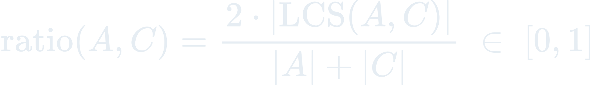

This is the Ratcliff-Obershelp measure over LCS. It lies in [0, 1]; 1.0 = A ≡ C, 0 = no shared tokens.

### Decision rule

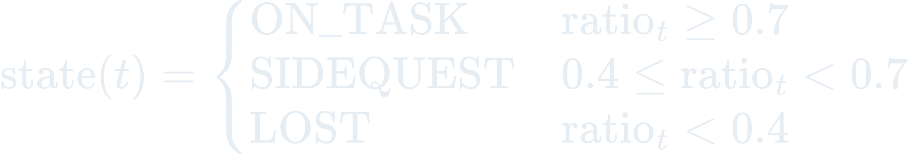= 0.7; SIDEQUEST if 0.4 <= ratio_t < 0.7; LOST if ratio_t < 0.4">

- `ratio ≥ 0.7` → ON_TASK for this turn.
- `0.4 ≤ ratio < 0.7` → SIDEQUEST (possible drift, feed to D2 HMM).
- `ratio < 0.4` → LOST (D4 orchestrator advisory candidate).
- `ratio < 0.5` in UserPromptSubmit → treat as constraint refresh; append delta to anchor.

### Implementation notes

Python stdlib `difflib.SequenceMatcher(a, b).ratio()` implements Hunt-Szymanski directly. Zero external deps. `autojunk=False` is required — junk-heuristic defaults corrupt the score for short anchors.

Normalization (`normalize()`): lowercase, `\w+` tokenize, drop 12-word stopword list. Stemming is NOT applied — stdlib has no stemmer and adding one would break the zero-dep contract. Consequence: "authenticate" and "authentication" score as distinct tokens. Mitigation: anchors are typically long enough that stemming-induced false drift is absorbed by the overall LCS signal.

### Failure modes

- **Literal-string gaming.** A developer could paraphrase the goal mid-session to game the ratio. Counter: D2 HMM corroborates via tool-pattern observations — HMM state cannot be gamed by lexical tricks.
- **Short anchor.** < 5 meaningful tokens makes ratio noisy. Counter: `orchestrator` returns `insufficient_data` when N < 5.

---

## D2 — Baum-Welch HMM Task-Boundary Inference

**Reference:** Baum L.E. and Welch L. (1970), "An inequality and associated maximization technique in statistical estimation for probabilistic functions of Markov processes", *Inequalities* III:1-8.
**Signature:** `infer_states(observations: list[tuple[str, str]]) -> list[str]`

### Derivation

A 3-state HMM over hidden states S = {ON_TASK, SIDEQUEST, LOST} emits observations oₜ = (tool_name, topic_tag) at each turn. Baum-Welch is the EM algorithm for HMMs: the forward-backward pass computes posterior state probabilities γₜ(i) = P(sₜ = i | O, λ), and the M-step re-estimates the transition matrix A, emission matrix B, and initial distribution π.

For Djinn, we run one forward-backward pass with informed priors, re-estimate B only (transitions and priors are fixed by domain knowledge), then one more forward-backward pass with refined B. Full EM convergence is unnecessary per-turn — posterior state labels are what we need.

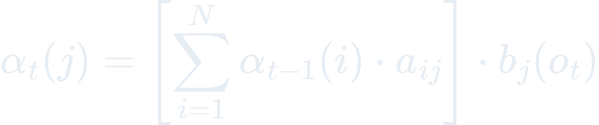

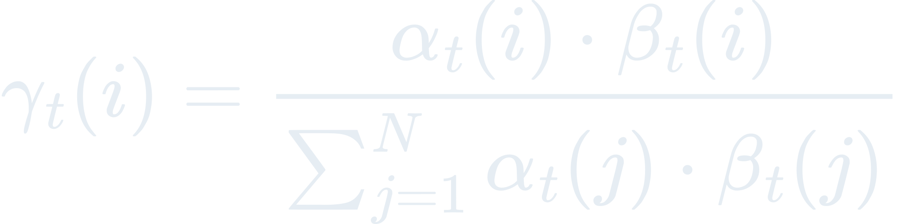

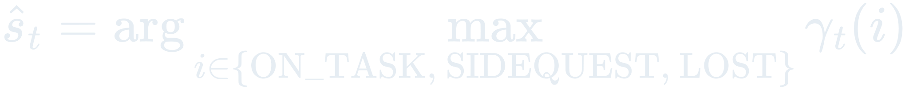

Priors: π = (0.8, 0.15, 0.05), A = [[0.80, 0.15, 0.05], [0.30, 0.60, 0.10], [0.10, 0.20, 0.70]]. Strong self-transition on LOST reflects the observation that once an agent is truly off-task, recovery within ≤ 5 turns is rare.

### Decision rule

State label at each timestep = argmax_i γₜ(i). A tail of 5 observations where `count(LOST) ≥ 3` classifies the drift as `drift_kind=lost`; 3+ SIDEQUEST as `side_quest`; else `refocus`.

### Implementation notes

Pure Python with per-timestep row normalization to avoid underflow over long sequences (64-observation sliding window). Emission vocabulary grows with observed (tool, topic) pairs; B re-estimation is add-ε smoothed.

### Failure modes

- **Emission-vocabulary explosion.** Unbounded growth of (tool, topic) pairs would blow memory. Counter: 64-observation window bounds effective vocab size.
- **Prior drift.** A session where LOST is actually normal (e.g., exploratory research) would persistently misfire. Counter: D5 posterior widens the acceptable band per intent-type.

---

## D3 — Vitter Reservoir Sampling (Algorithm R)

**Reference:** Vitter J.S. (1985), "Random sampling with a reservoir", *ACM Transactions on Mathematical Software* 11(1):37-57.
**Signature:** `update_reservoir(reservoir: list, turn: dict, n_seen: int, k: int = 32) -> list`

### Derivation

Algorithm R maintains a uniform random sample of size k from an input stream of unknown length N. On the i-th item (1-indexed):

- If i ≤ k: append to reservoir.
- Else: generate j uniformly from {0, ..., i-1}. If j < k, replace reservoir[j] with the i-th item.

Invariant: after processing N items, each item in the stream has probability exactly k/N of being in the final reservoir.

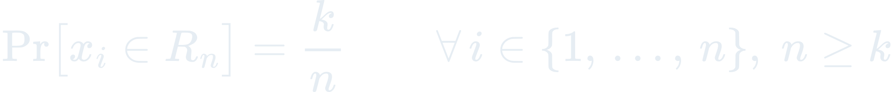= k">

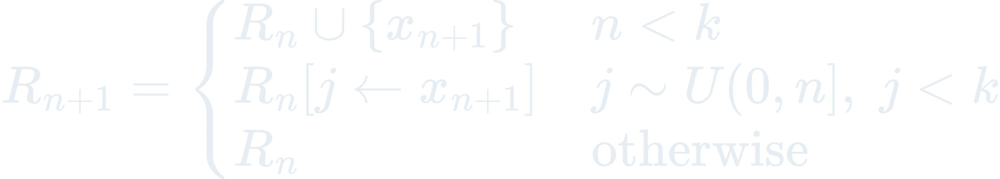

### Decision rule

k = 32. A 32-sample reservoir provides enough data for a meaningful bootstrap CI while capping per-session memory at O(1). Minimum N for bootstrap is 5; below that the honest-numbers contract returns `insufficient_data`.

### Implementation notes

Stdlib `random.randint(0, n_seen - 1)` (inclusive on both ends) plus a list slot swap. `n_seen` is tracked separately from `len(reservoir)` so stream position is preserved across sessions via `reservoir.json`.

### Failure modes

- **Non-uniform early bias.** The first 32 turns are all kept regardless. Counter: drift advisories gated on N ≥ 5 AND preservation < 0.7; early turns rarely trip both.
- **Reseed resets N.** `/reorient` archives the old reservoir so the new intent gets a fresh N — intentional, documented in the skill.

---

## D4 — PageRank Utterance-DAG Ranking

**Reference:** Brin S. and Page L. (1998), "The anatomy of a large-scale hypertextual Web search engine", Stanford InfoLab.
**Signature:** `pagerank(dag: dict, damping: float = 0.85, eps: float = 1e-6) -> dict[str, float]`

### Derivation

PageRank computes a stationary distribution over a graph via iterative relaxation:

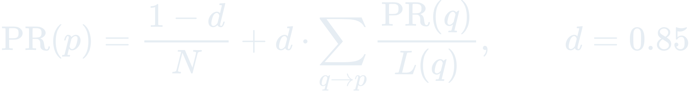 p} PR(q)/L(q), d = 0.85">

where d = 0.85 is the damping factor and L(q) is the out-degree of q. Dangling nodes (no out-edges) redistribute mass uniformly — the standard Brin-Page treatment.

For Djinn, nodes are agent utterances (turn records) and directed edges connect utterances that touched the same file path in `tool_input` / `tool_response`:

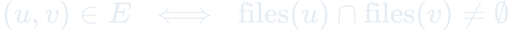
 The intuition: a "conversational" turn that merely restated the goal without touching artifacts will have no in-edges and will end up near the teleport floor, while a turn that shaped a file many later turns also touched will score high.

### Decision rule

Top-10 utterances by PR score are the "load-bearing" ones for the session. Bottom-N below `1/N * (1-d)` are "noise". The `/rank` skill surfaces both.

### Implementation notes

Sparse power-iteration over a `dict[str, list[str]]` adjacency. Hard cap at 100 iterations; convergence check `sum(|new - old|) < eps=1e-6` typically triggers at 20-50 iterations.

### Failure modes

- **Retrieval-style drift.** The whole reason we use PageRank over file-touch edges rather than semantic similarity is that "similar" turns are not "influential" turns — the LangChain vector-RAG failure. Do NOT substitute cosine similarity for the edge function.
- **Dangling-heavy graphs.** Early-session graphs where few files have been touched collapse to a near-uniform distribution. Counter: `/rank` reports N; developers interpret low-N ranks with appropriate skepticism.

---

## D5 — Gauss Accumulation (Intent-Type Drift Signature)

**Reference:** Gauss C.F. (1809), *Theoria Motus Corporum Coelestium* — least-squares foundation for recursive EMA-with-posterior updates. Ecosystem precedent: Wixie E6, Emu A7, Crow H6.
**Signature:** `update_posterior(prior: dict, observation: dict, alpha: float = 0.3) -> dict`

### Derivation

A per-(intent-type, developer) posterior P over drift-signature features:

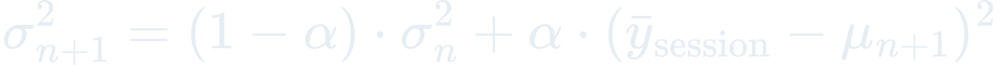

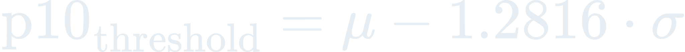

α = 0.3 corresponds to a ~30-day EMA half-life when sessions occur roughly daily. The posterior captures the developer's calibrated "acceptable drift" envelope per intent type: a research session earns a wider tolerated band than a bugfix session.

### Decision rule

`orchestrator` uses `p10_threshold` from the posterior as the per-(intent, developer) advisory cutoff instead of the hardcoded 0.7. A session whose preservation stays above `p10` is deemed to be "within calibrated envelope". Below p10 triggers the real-drift verdict.

### Implementation notes

JSONL append-only `learnings.jsonl` for backtesting raw observations; keyed JSON `posteriors.json` for the fitted posteriors. Both persisted via atomic write-tmp-rename (`shared/scripts/state_io.py`).

### Failure modes

- **Insufficient priors.** First 3 sessions per (intent, developer) pair have noisy posteriors. Counter: the orchestrator falls back to the prior-free threshold 0.7 when `n_sessions < 3`, and notes this in the advisory.
- **F11 Reward hacking.** Developer quietly narrows intent mid-session to hit the band. Counter: the refresh-delta log in `anchor.json` records every pivot; posterior updates ignore sessions with many refresh deltas (flagged as "pivot-heavy").
